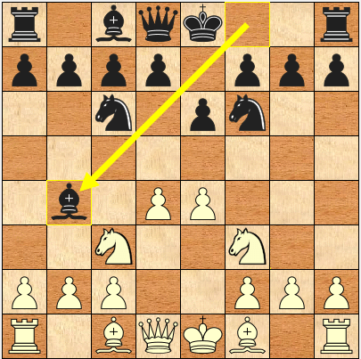

#  Horus-Chess
Repository for Horus - My Chess Engine.  
Licensed under the GNU General Public License ( GPL 3.0 ).

Horus is a [CECP](http://www.open-aurec.com/wbforum/WinBoard/engine-intf.html) compatible chess engine that obeys full FIDE rules.

## Features
+ Mailbox style board representation
+ Negamax with alpha-beta pruning
+ Quiescence search
+ Simple eval function using piece square tables
+ Static Exchange Evaluation(for analyzing captures)
+ Object Oriented Design

## Building - Linux
The Makefile is configured to build 3 executables, namely: Horus_Debug, Horus and Horus_SuperFast.  
Horus is the normal release build while Horus_SuperFast uses flags to make use of the native architecture of the processor.  

```
git clone https://github.com/universecoder/Horus-Chess.git
cd Horus-Chess/
make
make install
```
'make clean' deletes the executables.  
'make install' copies Horus to the '/usr/games/' directory.  

Windows builds are available here: http://www.andscacs.com/horus/horus.zip  
Thanks to [@ChessGUI](https://github.com/ChessGUI) for these.  

## Running
First install xboard(apt-get install xboard) and then click Options->Load New First Engine.  
Navigate to /usr/games/ and select Horus.



## Resources
+ [The Chess Programming Wiki(CPW)](https://chessprogramming.wikispaces.com/)
+ [Talkchess](http://talkchess.com/forum/index.php)
+ ##chessprogramming on Freenode IRC

## Future Work
+ Transposition tables
+ Bitboard based Engine - leads to faster move generation.
+ Opening Book
+ Null move heuristic
+ Better eval function - use more heuristics
+ Endgame tables

### Personal Notes
I built Horus to learn about basic AI algorithms. I ended up studying iterative deepening, quiescence search, alpha-beta pruning, negamax etc. Implementing "board game" specific stuff like the concept of move generation and evaluation functions was a good experience.  Another advantage included learning the GNU Make utility along with the importance of object oriented design.  

Special thanks to [Sven Schüle](https://chessprogramming.wikispaces.com/Sven+Sch%C3%BCle) for the guidance. A big thank you to the Freenode IRC community ##chessprogramming, where you can hang out daily and interact with like minded people.
